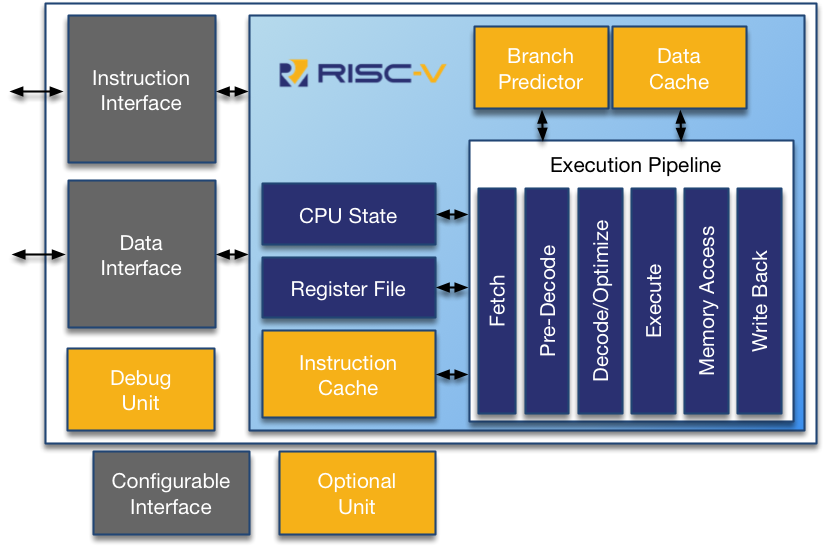

# RV32I CPU Implementation

This is a simple implementation of the open-source RISC-V instruction set architecture that can be run on FPGA, but more specifically for the icepi-zero. Make no mistake, this is not emulation on a microcontroller, this is a fully standalone system that you can run custom code on.

## How to run

If you want to try to it out, you'll need an FPGA board. It's easiest to do it with the icepi-zero, since it's the board I designed it for. If you wanted to use a different board, you'd need to adapt the port names in the `top.v` module.

## AI Usage

Claude was used for debugging some of the code, however none of the code is fully AI generated.  